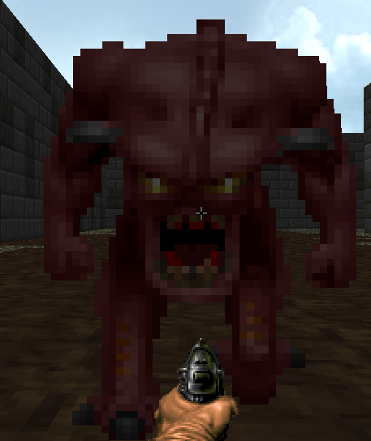

# Doomenstein

## Doomenstein v4.0:

### Features Added and Tested:

	- Weapons 	- Energy Based Weapons Vs Physical Based Weapons
	- Weapons 	- XML driven Cooldown and overheat system for energy based weapons. Firing them adds heat which decays over time after not firing for a second. Once overheated, the player cannot use this weapon until the  heat bar completely 0s out based on a time defined in XML. Heat decays even if the weapon is not the current active one the player has out. 
	- Weapons 	- XML driven Reload system for physical weapons. The player can carry extra ammo and it correctly manages itself by adding up to the magazine size amount of rounds each time the weapon is reloaded. Automatically reloads once empty and everything is defined in the XML.
	- Weapons 	- Trace Rifle added to the game. Hold down fire to shoot a continuous beam instead of individual shots.
	- Gameplay 	- Added infinite survival mode. Generates waves based on enemy cost and a set budget that gradually increases. Ends when you die.
	- Gameplay 	- Added 1v1 arena PvP mode. First player to 5 kills wins, takes place on a unique map with random spawns.
	- Gameplay	- Added Pickup actor types. Ammo Boxes are the only things demonstrating that system right now. They were necessary to help the new ammo system work.
	- Enemies	- Added 2 new simple derivative enemies: Tanks (Blue, more health slower) and Rushers (Red, more damage and faster)
	- Enemies	- Added ability for enemies to drop pickups on death.
	- UI		- Added Menu and reset logic for the game. You should be able to play over and over with no issues. I think it looks neat as well.
	- UI		- Added UI support for the new weapon systems and game modes. Ammo count for physical weapons and a heat bar for energy weapons.
	- Graphics	- Added Point Light support (only used on projectiles currently) 64 max but I didn't really stress test it.
	- Graphics	- Added simple Skybox generation. To be honest i think I did it wrong because there are seam lines in it, but I can't tell if its because I have a crappy skybox image.
	- Graphics	- Expanded map generation to support higher ceilings and random greebling on walls. This is all XML driven in MapDefinitions and TileDefinitions
	- Graphics	- Slightly adjusted textures for custom purposes
	- Sound		- Added sound effects for all new and custom elements of the game (Overheat, Reloading mainly)

### Controls:

Menu:

    W 		- Scroll Up
    S 		- Scroll Down
    Space 		- Select

Keyboard Controls:

    W		- Move Forward
    A		- Move Left
    S		- Move Backward
    D		- Move Right
    LMB		- Fire
    RMB		- Secondary Fire (unused)
    R		- Reload
    SHIFT		- Run
    MOUSEWHEEL 	- Change Weapons

XBOX Controls:

    LEFTSTICK	- Move
    RIGHTSTICK	- Aim
    B		- Toggle Run/Walk
    X		- Reload
    RIGHTBUMPER	- Change Weapon
    LEFTBUMPER	- Change Weapon
    RIGHTTRIGGER	- Fire

Hotkeys:

    P		- Pause Game
    T		- Slow Mo
    O		- Advance Frame
    `		- Dev Console
